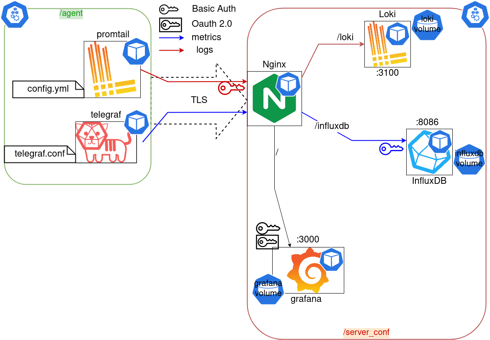

# argus
One node observability stack: Grafana, Influxdb and Loki in a docker-compose

The main purpose of **Argus** is to fill the gap I often encountered in monitoring strategies between: 

* on premise approaches, straightforward but often impossible to reproduce programmatically
* cloud oriented approaches, highly industrialized but relying on systems hard to master or to install on premise (e.g. k8s)

In most on premise scenarios, your monitoring server does not need to be replicated, nor does it need to live on any fancy cloud service: a good old fashioned, yet intelligent pre provisioned [docker-compose](https://github.com/docker/compose) file is all you need. Argus is such a docker-compose file

## General Architecture

## Usage

### Monitoring server

Populate your **.env** file next to `./docker-compose.yaml` and run `docker-compose up`

### Agents

On every server you plan to monitor with Argus, populate your **.env** file next to `agent/docker-compose.yaml` and run `docker-compose up`

## Variables

|             name             | nginx | grafana | influxdb | loki  | description |
| :--------------------------: | :---: | :-----: | :------: | :---: | :---------: |
| `AUTH_GITLAB_ALLOWED_GROUPS` |       |    X    |          |       |             |
|   `AUTH_GITLAB_CLIENT_ID`    |       |    X    |          |       |             |
| `AUTH_GITLAB_CLIENT_SECRET`  |       |    X    |          |       |             |
|    `AUTH_GITLAB_ENABLED`     |       |    X    |          |       |             |
|     `GF_INSTALL_PLUGINS`     |       |    X    |          |       |             |
| `GF_SECURITY_ADMIN_PASSWORD` |       |    X    |          |       |             |
|      `GF_SERVER_DOMAIN`      |       |    X    |          |       |             |
|     `GF_SERVER_ROOT_URL`     |       |    X    |          |       |             |
|  `INFLUXDB_ADMIN_PASSWORD`   |       |    X    |    X     |       |             |
|    `INFLUXDB_ADMIN_USER`     |       |    X    |    X     |       |             |
|        `INFLUXDB_DB`         |       |         |    X     |       |             |
|       `INFLUXDB_USER`        |       |         |    X     |       |             |
|   `INFLUXDB_USER_PASSWORD`   |       |         |    X     |       |             |
|       `LOKI_PASSWORD`        |   X   |         |          |       |             |
|         `LOKI_USER`          |   X   |         |          |       |             |
|          `ORG_NAME`          |       |    X    |          |       |             |

|           name           | promtail | telegraf |                description                 |
| :----------------------: | :------: | :------: | :----------------------------------------: |
|       `ARGUS_URL`        |    X     |    X     | url root pointing to the monitoring server |
|        `HOSTNAME`        |          |    X     |                                            |
|      `INFLUXDB_DB`       |          |    X     |                                            |
|     `INFLUXDB_USER`      |          |    X     |                                            |
| `INFLUXDB_USER_PASSWORD` |          |    X     |                                            |
|     `LOKI_PASSWORD`      |    X     |          |                                            |
|       `LOKI_USER`        |    X     |          |                                            |

## Development

### Ongoing efforts

* SSL certs validation for `promtail` and `telegraf`
* Oauth2 authentication (promtail => loki telegraf => influxdb)
* Dashboard provisioning on grafana
* InfluxDB rentention

____

## Div

https://grafana.com/grafana/dashboards/13315
https://grafana.com/grafana/dashboards/14126

### InfluxDB 1.* compatible

https://grafana.com/grafana/dashboards/1443

### Loki Syslogs
https://grafana.com/grafana/dashboards/13766

https://gist.github.com/ruanbekker/c6fa9bc6882e6f324b4319c5e3622460
